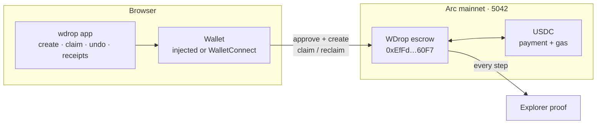
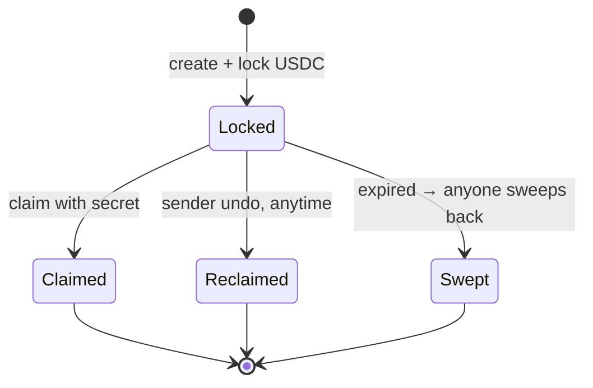
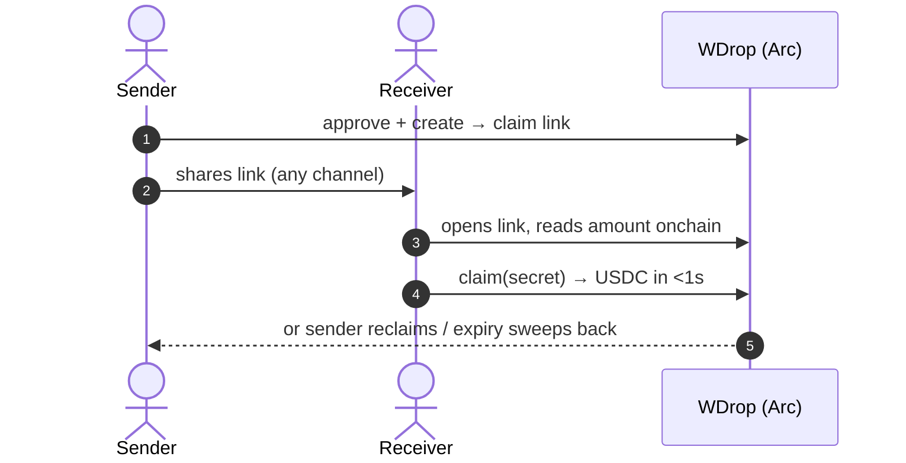

# wdrop — send USDC with an undo button

**Claim-link USDC payments on Arc mainnet. Lock funds behind a shareable link instead of
pushing them to an address. The receiver claims in one click; the sender can reclaim anytime
before that; expired drops auto-refund. Every step is an onchain event with a receipt.**

- Live: **https://wdrop.vercel.app**
- Contract (Arc mainnet, chain 5042): [`0xEfFd3f2B0a5719cD7E7bd885738c9cEF159660F7`](https://explorer.arc.io/address/0xEfFd3f2B0a5719cD7E7bd885738c9cEF159660F7)
- Built for [Arc Microgrants](https://dorahacks.io/hackathon/arc-microgrants/detail) (Circle, 20 × 500 USDC for live mainnet PoCs)

---

## Thesis

Stablecoin payments are **final**: one typo, one wrong network, one faked screenshot, and the
money is gone forever. The industry's answer so far is "be careful" — test-sends that double
fees, chat screenshots as proof, opaque CEX appeals. Meanwhile the ecosystem is rebuilding
chargebacks from scratch (Payy `Finality`, Circle's Refund Protocol) with liquidity pools and
arbitrators — heavy machinery for an everyday problem.

wdrop takes the opposite approach: **don't push money at an address; lock it behind a link.**
This recreates the card-network authorization window on finality rails with one minimal escrow
contract — no liquidity providers, no custody, no integration. The safe path becomes the easiest
path, and a $1 protected send stays economical because Arc charges gas in USDC with sub-second
finality.

> Irreversible money blocks normal humans. The product that wins is the one that makes the safe
> path the easiest path.

## The problem (verified, not vibes)

- `$18 USDC, $7.20 gas. Confirmed without checking.` — r/USDC
- `$2 USDC stuck — needs $0.98 ETH to move… is this the future?` — r/Metamask
- `No trustless escrow for small deals… middleman means trusting another person` — r/USDC
- A P2P trader lost **$10k** to a recycled payment screenshot; Binance P2P released crypto on a
  **chat screenshot** as "proof" — r/cryptorage, r/binance
- Endl (#3 Product Hunt, 316▲) top comment: *"stablecoin payouts are final, no chargeback if
  wrong wallet — what does dispute look like?"*
- ACM (Aug 2026): after finality, every reversal is a new forward transfer — reversal must be
  **engineered as escrow + compensating transfer**, not wished for.

## Product

Three screens, one job — turn "I owe you crypto" from a trust fall into a link:

1. **Lock** — amount + expiry (5 min–30 d) → USDC moves into escrow → shareable claim link.
   Link is auto-copied; the secret lives only in the URL fragment (`#k=`), never on a server.
2. **Claim** — receiver opens the link, sees the real onchain amount *before* connecting, one
   click → USDC in their wallet in under a second, gas paid in USDC.
3. **Undo** — sender reclaims anytime before claim (the demo wow-moment); anyone can sweep
   expired drops back to the sender. Optional per-drop arbiter for disputes.
4. **Prove** — every lock / claim / reclaim / sweep is an explorer-verifiable event plus a
   downloadable CSV receipt for the books.

What wdrop is **not**: an invoice engine, a payroll dashboard, a swap UI, a chatbot, a token.
Deliberately. Small real system > large fake system.

## How it works (60-second version)

No backend exists — static UI + wallet calls + one escrow contract on Arc. Secrets never leave
the browser (URL fragment only); memos stay in localStorage.



A drop lives in exactly one state at a time, and each `id` is single-use — once it leaves
`Locked` it can never move again:



The receiver sees the **real onchain amount before connecting** — a "$100 (actually $1)" scam
link is exposed without spending gas:



Full diagrams (undo/expiry paths, trust boundaries, receipts, deployment):
[`docs/ARCHITECTURE.md`](docs/ARCHITECTURE.md).

## Why Arc (not "deployed on Arc too")

- **USDC as gas** — a $1 protected drop costs cents to lock and claim. On ETH-gas chains the
  protection costs more than the payment. This is the economic prerequisite for the product.
- **Sub-second deterministic finality** — claiming feels like opening a link, not sending a wire.
- **Explorer-verifiable proof** — a claim is onchain evidence, not a screenshot. The receipt
  story only works on a chain with a usable explorer and fast confirmation.
- **24/7 settlement + 20 fiat stables on the roadmap** — EURC corridors and StableFX quoting
  are the natural next step for cross-border drops (see Roadmap).

## Live proof (Arc mainnet, real USDC)

| Step | Tx |
|---|---|
| Deploy | [`0x19ac…2fd0`](https://explorer.arc.io/tx/0x19acfc955dc81db77454207bb64c876dab348a5e7719419bad6f4dece3fe2fd0) (block 21863551) |
| Created drop #0 ($1) | [`0x443d…78aaf6`](https://explorer.arc.io/tx/0x443df9004b5d08aac557941a39fb7c3364742da828d0e99ac4a796342878aaf6) |
| Reclaimed drop #0 (undo) | [`0xa782…0361a7`](https://explorer.arc.io/tx/0xa782c93f91c2baf9017445363ead35a5f97a129c464c51d8bacf8505150361a7) |
| Created drop #1 ($1) | [`0x3341…921b4`](https://explorer.arc.io/tx/0x3341d743a5f69b177f526663f3b1cab9bace1a9f5ce98ace602b2c4eeec921b4) |
| **Claimed drop #1 (second wallet)** | [`0x8bc7…a4dbca`](https://explorer.arc.io/tx/0x8bc77e8f636feb998ee67c526db92b073e6f2bdb747227dbef0e0b59c9a4dbca) |

Full loop proven cross-wallet: lock → claim by a different address → reclaim path, all with
success receipts. Contract: 10/10 Foundry tests; frontend: `tsc` + `eslint` + production build green.

## Tech

- **Contracts** (`contracts/`, Foundry): one self-contained `WDrop.sol` (~240 lines, zero imports)
  — `create` / `claim` (secret reveal) / `reclaim` (sender undo) / `sweepExpired` (permissionless)
  / `resolve` (arbiter) + single-use replay-safe IDs, 10k USDC cap, reentrancy guard.
- **Web** (`web/`, Next.js 16 + TypeScript + viem/wagmi): injected + WalletConnect (mobile QR),
  simulate-then-write with friendly errors, QuickNode primary RPC + public fallback with
  latency-ranked failover, referrer-locked endpoint token, receipts table + CSV export.
- **No backend, no database, no custody.** Memos stay in the sender's browser; the secret never
  leaves the URL fragment. See [`docs/SECURITY.md`](docs/SECURITY.md) (includes honest known
  limits: bearer-link claim race, receiver needs gas, no onchain privacy yet).
- Full system diagrams: [`docs/ARCHITECTURE.md`](docs/ARCHITECTURE.md) — overview, state
  machine, lock/claim/undo sequences, trust boundaries, receipts flow, deployment topology.
- Docs: [`docs/DEPLOY.md`](docs/DEPLOY.md) · [`docs/DEMO.md`](docs/DEMO.md) (75s script) ·
  [`docs/SECURITY.md`](docs/SECURITY.md) · [`docs/SUBMISSION.md`](docs/SUBMISSION.md)

## Go-to-market

Distribution is the link itself — every drop is a viral surface carrying wdrop branding:

1. **Wedge (now): P2P sellers + friends settling money.** People already doing USDC deals over
   Telegram/Discord/X DMs with zero protection. One link replaces the $1 test-send + screenshot
   dance. Entry point: crypto-native communities, freelance Discords, event/ticket resales.
2. **Expand (next): "Accept protected" button for small merchants.** Link-checkout for digital
   goods where chargeback machinery is overkill — escrow window + one-click refund instead.
   Answers Endl's most-upvoted complaint directly.
3. **Scale (later): vaults + corridors.** Same primitive becomes spending-cap vaults (kids'
   allowances, AI-agent budgets — same contract shape: caps, allowlists, kill-switch) and
   EURC/MXN/BRL corridors via StableFX for cross-border drops.
4. **Grant ladder:** Microgrants (proof) → Circle Grant Program milestones (corridors → dispute
   queue → merchant SDK), each milestone a shippable, measurable integration.

Retention comes from the address book of trusted counterparties, recurring drops, and receipts
that accountants can open — not from points or tokens. There is no token, by design.

## Vision

Money links should work like file links: shareable, revocable until opened, auditable after.
Today sending crypto feels like launching something into the void; it should feel like handing
someone a sealed envelope they open in front of you — with a notary (the chain) watching.
wdrop is the smallest complete version of that: **reversible-by-default stablecoin transfer**,
starting on Arc where USDC-gas makes it economical, expanding into the settlement primitive
for everyday P2P commerce, agent spending, and merchant checkout.

## Roadmap

- [x] Escrow + web app live on Arc mainnet with cross-wallet proof
- [ ] 90s demo video + DoraHacks submission (in progress)
- [ ] WalletConnect polish + custom domain (+ referrer whitelist update)
- [ ] Spending-cap vaults (kids + AI agents, same primitive)
- [ ] Gift skins (expiring/quiz-gated envelopes — distribution play)
- [ ] Arbiter dispute queue UI (per-drop `resolve` path)
- [ ] EURC corridor via onchain pools → StableFX RFQ compare
- [ ] Merchant "accept protected" button + refund flow
- [ ] Recipient-bound commit-reveal (removes the mempool claim race)

## Quickstart

```bash
# contracts
cd contracts && forge build && forge test   # 10 passed

# deploy (needs ~$5 USDC on Arc for deploy + smoke test; bridge via canonical CCTP)
export ARC_RPC_URL=https://rpc.mainnet.arc.io PRIVATE_KEY=0x...
forge script script/Deploy.s.sol --rpc-url $ARC_RPC_URL --private-key $PRIVATE_KEY --broadcast

# web
cd ../web && cp .env.example .env.local  # fill NEXT_PUBLIC_WDROP_ADDRESS + deploy block
pnpm install && pnpm dev
```

Full runbook: [`docs/DEPLOY.md`](docs/DEPLOY.md).

## Status

MVP for Arc Microgrants — live, proven, submitted soon. Remaining: demo video + builder profile
link (see [`docs/SUBMISSION.md`](docs/SUBMISSION.md)).
