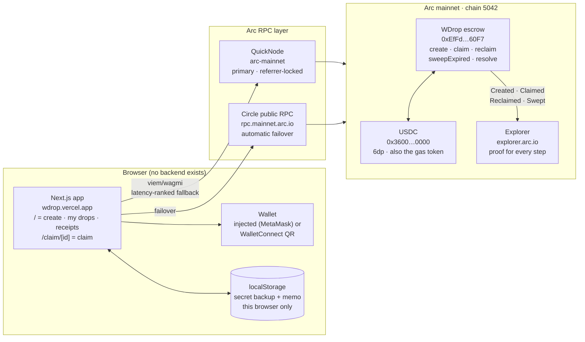
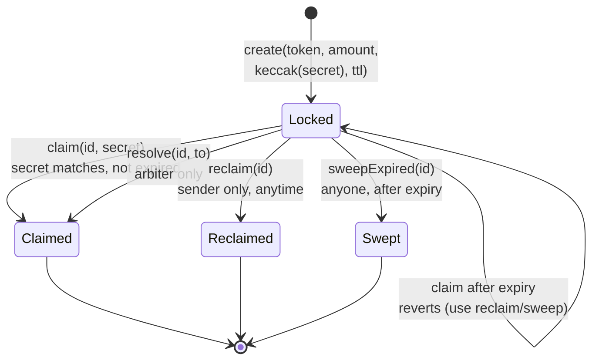
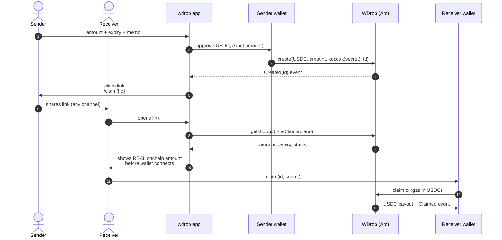
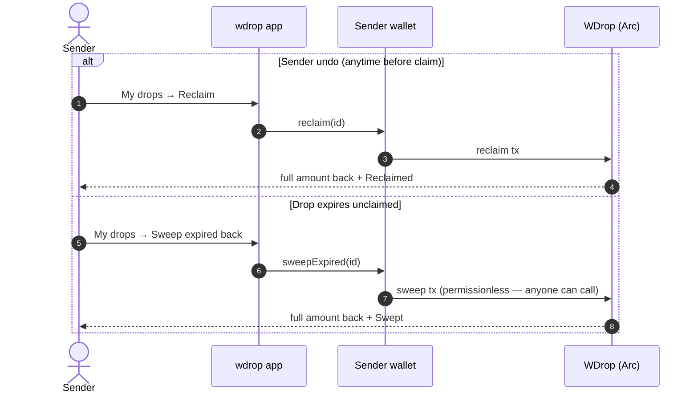
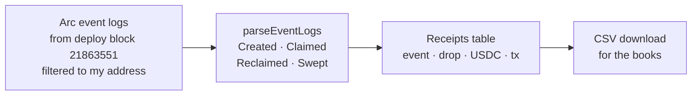
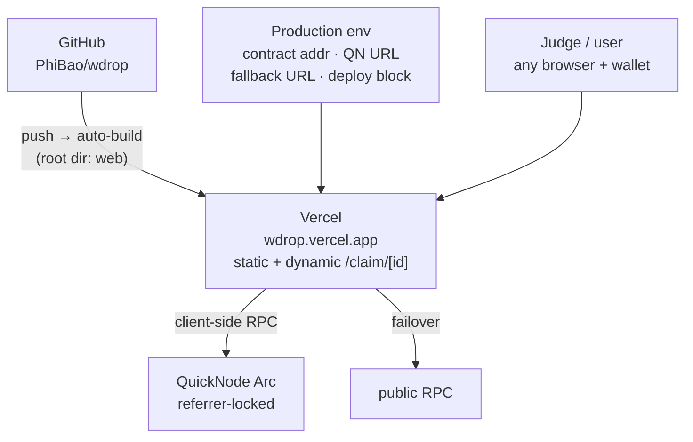

# ARCHITECTURE.md — wdrop

How wdrop is put together, what lives where, and where trust sits. All diagrams are
Mermaid — they render directly on GitHub.

## 1. System overview



Key property: **there is no server.** The Next.js app is static UI + wallet calls. Secrets and
memos never leave the browser (secret travels in the URL fragment `#k=`, which browsers never
send anywhere). The contract is the only shared state.

## 2. Drop lifecycle (contract state machine)



Every transition emits an event (`Created / Claimed / Reclaimed / Swept / Resolved`) and each
`id` is single-use — once it leaves `Locked` it can never move again (replay-safe by construction).

## 3. Happy path: lock → share → claim



Notes:
- The claim page displays the amount from chain **before** connect — a mismatched
  ("$100, actually $1") link is visible without spending gas. Deterministic anti-scam.
- `simulateContract` runs before every write so failures surface as friendly copy
  (wrong secret, expired, already closed, no gas) instead of raw reverts.
- Claiming is an onchain action: the receiver needs ~$0.10 USDC on Arc for gas.
  The UI states this up front (see `app/claim/[id]/page.tsx`).

## 4. Undo + expiry paths



## 5. Trust boundaries

| Zone | Holds | Trust assumption |
|---|---|---|
| WDrop contract (Arc) | Locked USDC, claim hashes, expiries | Code only. Owner can't move funds (only ≤1% fee on claim). No upgradeability, no selfdestruct |
| Sender browser (localStorage) | Claim secret backup, private memo | Same-origin. Lost browser = link still works if URL was shared; unshared + lost = funds locked until expiry, then sweepable |
| Claim link URL | `id` + secret in `#k=` fragment | Bearer model: anyone holding the full link can claim. Fragments never hit servers or logs |
| RPC layer (QN + public) | Nothing (transport only) | QN token is referrer-locked to `wdrop.vercel.app` + `localhost`; scraped tokens get 401 |
| Wallet (MetaMask / WC) | Keys, signing | Standard EOA trust. Exact-amount approvals only, never unlimited |

Known limits (disclosed in `SECURITY.md`, not hidden): bearer-link claim race in the public
mempool (negligible for $1–10 drops on PoA sub-second blocks; roadmap = recipient-bound
commit-reveal), no onchain amount privacy (Arc view-keys are roadmap), receiver needs gas.

## 6. Receipts (proof, not analytics)



Receipts query only the connected wallet's own actions. Per-drop claim status (including claims
by others) lives in My drops. Every row deep-links to `explorer.arc.io/tx/<hash>`.

## 7. Code map

```
wdrop/
├── contracts/                  Foundry
│   ├── src/WDrop.sol            the whole trust surface (~240 lines, zero imports)
│   ├── test/WDrop.t.sol         10 tests: claim, wrong secret, double-claim,
│   │                            reclaim ACL, expiry + sweep, TTL bounds, arbiter, replay
│   └── script/Deploy.s.sol      mainnet deploy (chain 5042)
└── web/                        Next.js 16 + TS + viem/wagmi
    ├── app/page.tsx             home: pitch + CreateDrop + MyDrops + Receipts
    ├── app/claim/[id]/page.tsx  claim: onchain amount first, then connect, then claim
    ├── components/Providers.tsx wagmi config: injected + WalletConnect,
    │                            latency-ranked QN→public fallback transports
    ├── components/CreateDrop.tsx   approve-exact + simulate + create + auto-copy link
    ├── components/MyDrops.tsx      sender's drops + reclaim / sweep buttons
    ├── components/Receipts.tsx     own-action event log + CSV export
    └── lib/
        ├── arc.ts               chain 5042, USDC 0x3600…0000, contract addr, explorer links
        ├── abi.ts               contract ABI + named single-event ABIs (no magic indices)
        └── wdrop.ts             secret gen, keccak link builder, USDC formatting, CSV
```

## 8. Deployment topology



Build is `tsc` + `eslint` + static prerender; all chain reads happen client-side at runtime,
so prerender never touches RPC.
